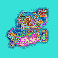
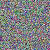

# Console Application Bitmap Transformer

*Author: Peyton Cysewski, Leah Russo*

----

## Description
This console application will read a bitmap in from disk, run one or more color or raster transforms and then write it out to a new file. We experimented with few simple transforms:<br>
- Horizontal Mirror: The image is flipped horizontally about a vertical axis. Each pixel was swapped accoring to its position on a "row".
- Grayscale: The image was converted to grayscale by taking an average of the RGB levels of each pixel and applying that average back to the red, green, and blue channels, leaving behind a grayed out image.
- Deepfry: This is made up, but was the funny result of an improper grayscale filter. The average of the RGB levels was attained in the same manner as before, but then it is used to form a nine-digit number (repeating the averaged three-digit number three times consecutively) which acts as the new RGB value for each pixel.
- Randomize: This was done using a random generator to assign an RGB value from 0 to 255 for each RGB channel on every pixel.

---

### Getting Started
Clone this repository to your local machine.

```
$ git clone https://github.com/Peyton-Cysewski/bitmap-transformer.git
```

### To run the program from the Command Line:
Enter into the correct root level directory once the repo has been cloned.

Enter the command: ``./gradlew run --args "<input/file/path.bmp> <output/file/path.bmp> <transform command>"`` where:
- The input path is the path (absolute or relative) to a bitmap image file that will be copied and transformed.
- The output path is the path (absolute or relative) to where the transformed bitmap image will be written to (this includes the file name of your choice).
- The transform command will be one of four: `"mirrorHorizontal"`, `"grayscale"`, `"randomize"`, or `"deepfry"`.

---

### Image Transform Results

#### Control BMP Image

#### After Horizontal Mirror

#### After Grayscale

#### After Deepfry

#### After Randomized


---

### Change Log
1.0: *Initial Release* - 17 Sept 2020
